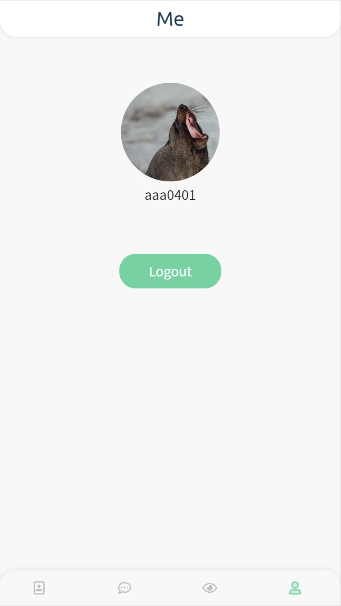
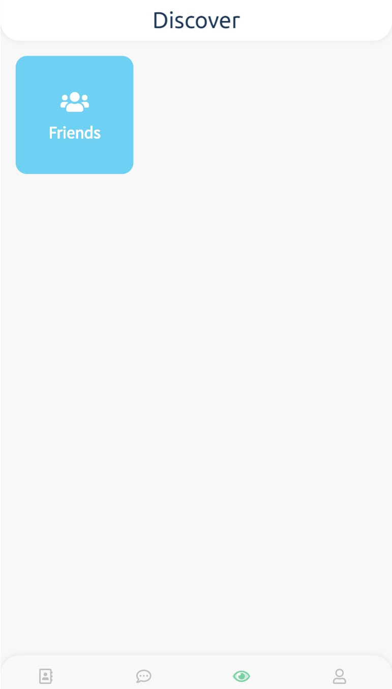
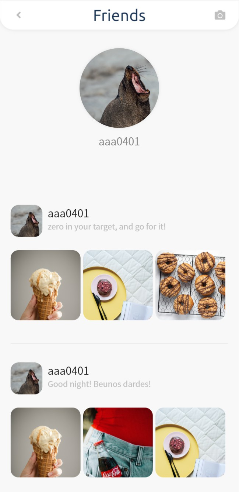

# vue-wechat

學習來源: [VueCli3.x 全栈开发-实现微信朋友圈](https://www.udemy.com/vuecli3forwechat/)

> 後端: MongoDB
> 前端: Vue.js

| Date       | Chapter            |
| ---------- | ------------------ |
| 2019/05/13 | 後端 API 配置      |
| 2019/05/20 | 新增 Client 端     |
| 2020/04/05 | 前端顯示畫面及功能 |

## 指令

| npm run dev | 啟動專案 |

## 參考設計

- [Login UI by Sumesh Verma](https://dribbble.com/shots/4754884-Login-UI)
- [Skillmarket App - Deal Offer Script by Skai Trip](https://dribbble.com/shots/6935536-Skillmarket-App-Deal-Offer-Script)

## 畫面

